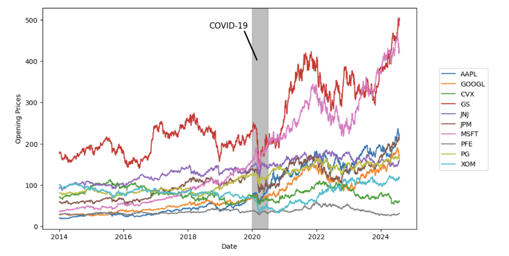
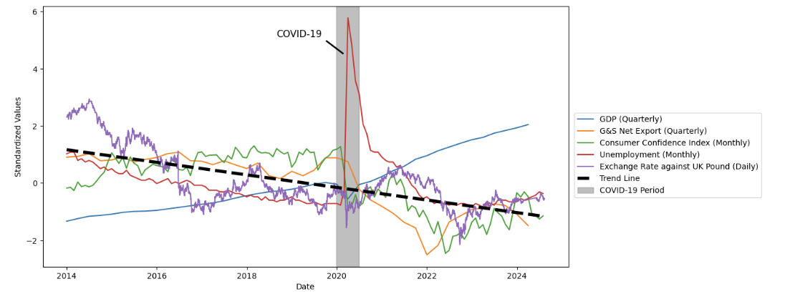
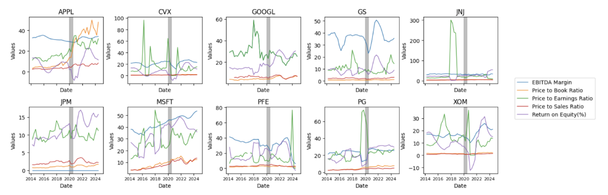
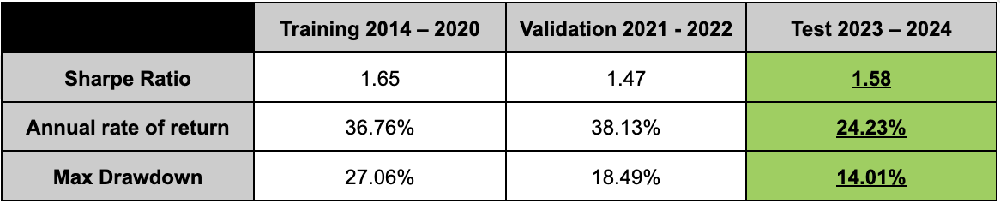
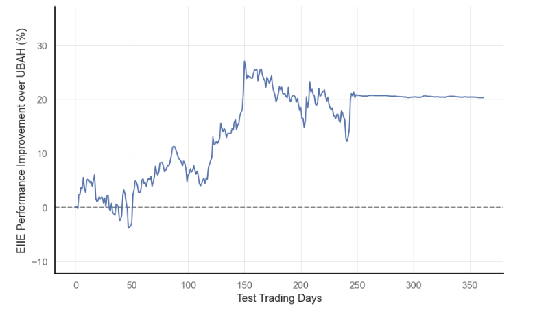
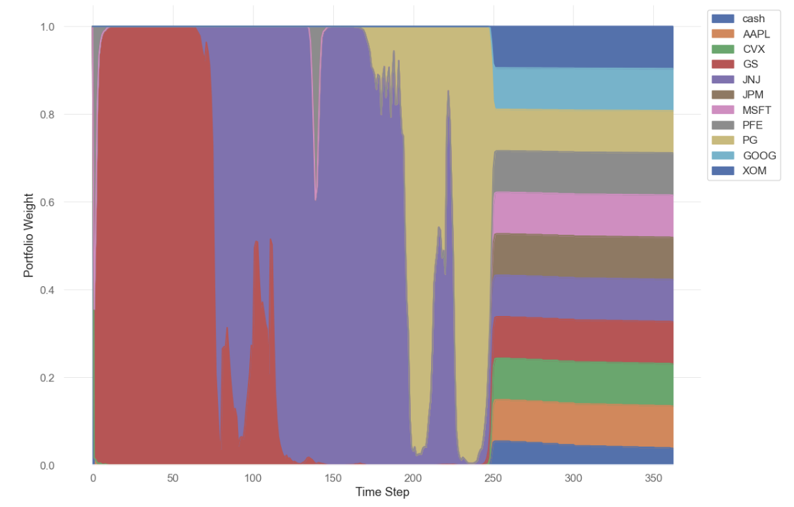
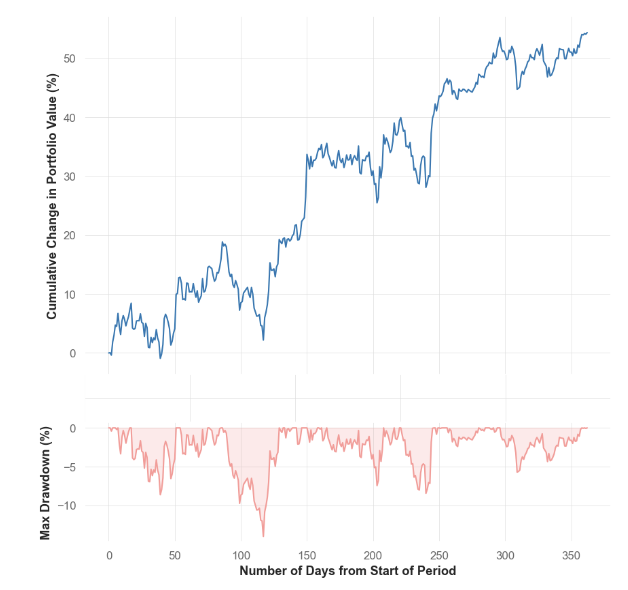
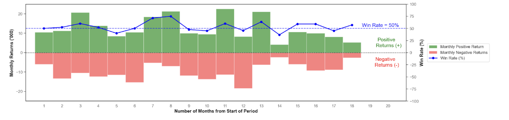

# Financial Portfolio Optimization using Reinforcement Learning

Hello! We are a group of NUS final year undergraduates. This repository contains code and resources for our DSE4212 final project topic: financial portfolio optimization using reinforcement learning (RL) techniques. We aim to explore RL's application in stock portfolio allocation using neural networks to generate optimum stock allocations for prospective investors. Our project builds upon the portfolio optimization environment provided by the [FinRL Library](https://doi.org/10.5753/bwaif.2023.231144) (Costa & Costa, 2023), modifying the state space, action space, and rewards function from the environment to reflect the conditions from which the agent will be trained. Check out the original implementation by FinRL [here](https://github.com/AI4Finance-Foundation/FinRL/blob/master/examples/FinRL_PortfolioOptimizationEnv_Demo.ipynb)!

## Table of Contents

1. [Project Overview](#project_overview)
2. [Project Features](#project_features)
3. [Results](#results)
4. [Requirements and Setup](#requirements)
5. [Repo Structure](#repo)
6. [License](#license)

## Project Overview {project_overview}

The goal of this project is to train an automated portfolio allocation agent. Using the EIIE framework with CNN-based architectures, the agent learns to allocate assets dynamically. We explored the selection of features from a wide range of variables, including macroeconomic and fundamental indicators. We also explored the use of Variational Mode Decomposition (VMD) as a method of extracting more information from closing price signal. Our project also attempts to perform hyperparameter tuning to maximise our model's performance.

## Project Features {project_features}

#### Data

Training, validation and test data is taken from 2014-2024.

**Stock data** from 10 companies belonging to 5 different sectors are extracted during this time period, namely Apple (AAPL), Google (GOOGL), Chevron (CVX), Goldman Sachs (GS), Johnson and Johnson (JNJ), JPMorgan&Chase (JPM), Microsoft (MSFT), Pfizer (PFE), Procter & Gamble (PG) and Exxon Mobil (XOM).



**Macroeconomic indicators** like GDP growth can influence investor sentiment to invest in various types of stocks. The indicators show a sharp downward trend (other than unemployment) over time, and this is likely due to the COVID-19 pandemic as denoted by the grey band. The economies are still recovering from the pandemic as shown by the gradual increases in their standardised values following COVID-19.



**Fundamental factors** are key to portfolio allocation, helping investors assess a stock's intrinsic value and make informed decisions based on financial health, growth potential, and market valuation. With differing performances of companies in each metric, this facilitates better training of the agent as they can learn to make better decisions in the allocation of stocks.  The factors extracted include Earnings before Interest, Taxes, Depreciation, and Amortisation ratio (EBITDA Ratio), Price to Book Ratio, Price to Earnings Ratio, Returns on equity, and Price to Stock Ratio.



**Variational Mode Decomposition** isolates a set of intrinsic mode functions from close prices, each representing different frequency components (Nasiri & Ebadzadeh, 2022). VMD allows the model to capture underlying patterns.

#### Feature selection

To train the model, we performed variable selection by applying a parallel time-series regression on Apple stock prices. The data was collected from the training period, spanning from 2014 to 2020. We used LASSO Regression with 5-fold cross-validation to identify the optimal value of the regularisation parameter, C, which minimised the Mean Squared Error (MSE). From this, we identified the features with non-zero weights, which were then selected for inclusion in the final model.

From the factors available from analysis, the final features were selected and eventually used to train the model with their corresponding descriptions.

| Factor                               | Description                                                                                                                    |
| ------------------------------------ | ------------------------------------------------------------------------------------------------------------------------------ |
| Closing Prices                       | Closing prices of the corresponding company stocks                                                                             |
| High_SPY                             | Highest price of SPDR S&P 500 ETF                                                                                              |
| Close_SPY                            | Closing price of SPDR S&P 500 ETF                                                                                              |
| Fear Greed                           | Financial Indicator to show investors’ sentiment                                                                              |
| Rating Score                         | Company rating score                                                                                                           |
| Pound-Dollar Exchange Rate           | Exchange rate of the US-UK                                                                                                     |
| Unemployment Rate                    | Unemployment rate of the US economy                                                                                            |
| EBITDA Margin                        | Measures the company’s overall financial performance and profitability                                                        |
| Price to Book Ratio                  | Shows the ratio of the company’s market value to its book value                                                               |
| Price to Earnings Ratio              | Indicate the company’s current share price relative to earnings per share                                                     |
| Return on Equity                     | Ability of a company to generate profits from its shareholders’ equity (for every dollar of equity)                           |
| Variational Mode Decomposition (VMD) | Decomposes stock price signals into intrinsic mode functions to capture multi-scale trends and volatility while reducing noise |

#### Improvements to Model Pipeline


- **Reinforcement Learning Agent** using the CNN implementation of the EIIE architecture for dynamic portfolio management.
- **Custom Reward Functionality** that enables user to take into account returns, risk and max drawdown.
- **Hyperparameter Tuning** of the policy network via a grid search across 5 different parameters, evaluating all possible combinations of: Time Window, K-size, Convolutional Features (Mid and Final Layers), Learning Rate.

## Results {results}

Our trained EIIE model demonstrated consistently strong risk-adjusted returns, with Sharpe Ratios of 1.65 during training, 1.47 in validation, and 1.58 in testing. While annual returns declined in testing to 24.23% from 38.13% in validation, the model improved risk management, reducing the maximum drawdown to 14.01%. This suggests that although returns moderated on new data, the model adapted well to unseen conditions, maintaining effective risk control. Performance tends to decline slightly as time extends beyond training, with annual returns decreasing. However, the stable Sharpe Ratio and reduced drawdown in testing indicate that the model preserves risk control while adapting to new data.



Comparing cumulative returns from an initial capital of $100,000, the performance of the proposed EIIE model was evaluated against the traditional uniform buy and hold (UBAH) strategy. Aside from a slightly weaker start, EIIE consistently outperformed the UBAH approach, with a maximum performance gap of up to 27% around day 150 of the test period.



Upon reviewing portfolio weights allocation via this visualisation, we noted that the agent initially focused investments in one or two key stocks, suggesting a selective strategy with higher concentration risk. This undermines the benefits of diversification, which is key to reducing volatility and improving risk-adjusted returns. Addressing this issue will require revisiting the reward structure to encourage more balanced weight allocations across assets.



We see a steady increase in portfolio value over the test period, signalling positive long-term performance and potential for capital growth. During this time, the portfolio experienced three drawdown events exceeding 5%, with the most extended drawdown lasting approximately two months. These drawdowns, while significant, were contained within a manageable range, reflecting the model’s ability to recover effectively from market declines. The bottom panel shows the maximum drawdown percentages, with the largest single drawdown at around 14% and most drawdowns averaging below 5%. This consistency implies a level of resilience in the model’s performance, managing risk effectively and avoiding prolonged or extreme losses. For investors, this pattern indicates that while the model encounters temporary declines, it maintains an overall upward trajectory and limits downside exposure. Additionally, the ability to keep most drawdowns within 5% reflects the model’s strategic asset allocation and adjustments in response to market changes, balancing growth with risk control. This stability, along with the observed cumulative growth, suggests the model’s suitability for long-term investment horizons, where temporary fluctuations are less impactful on overall portfolio health.



The win-rate metric highlights the portfolio’s monthly performance, with green regions indicating months of positive returns and red regions indicating losses. The model achieved an average monthly win rate above 50%, with 11 positive months compared to 7 negative months. This consistent prevalence of positive months suggests the model’s capacity to generate steady returns over the long term.



## Requirements and Setup {requirements}

To run this project, you'll need:

- Python 3.10+
- dependencies listed in `requirements.txt`

Install the dependencies with:

```bash
pip install -r requirements.txt
```

**Clone the repository:**

```bash
git clonehttps://github.com/haonanah/DSE4212.git
cd DSE4212
```

## Repository Structure (not done, someone help with this)

- `train.py`: Script to train the RL model.
- `evaluate.py`: Script to evaluate the model on test data.
- `preprocess.py`: Data preprocessing script that includes VMD.
- `final/packages/`: Contains implementations of different RL agents, including EIIE and custom reward functions.
- `models/`: Neural network architectures for EIIE, including CNN and LSTM variants.
- `data/`: Directory for input datasets.
- `EDA/`: Directory where EDA was performed
- `final/`:
- `README.md`: Project documentation.

## License {license}

MIT License

**Disclaimer: We are sharing codes for academic purpose under the MIT education license. Nothing herein is financial advice, and NOT a recommendation to trade real money. Please use common sense and always first consult a professional before trading or investing.**
